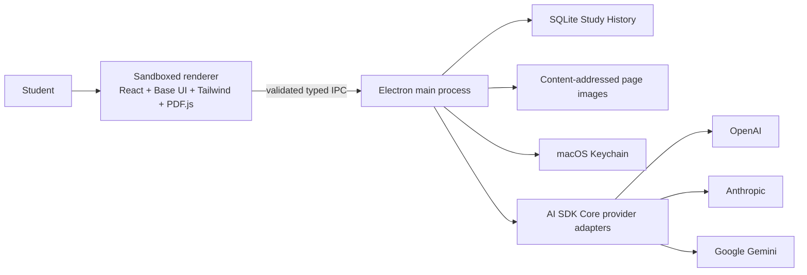

# Guided Document Study — v1 Product and Architecture Spec

## Product statement

A free, open-source macOS desktop app for students who read PDF documents and want to discuss selected material with a language model of their choice. The app combines a focused PDF reader with generic chat, sends requests directly to cloud model providers using student-owned API keys, and keeps study history on the device.

The first version is successful when a student can open a selectable document, select one or more passages, see exactly what page context will be sent, ask a question, and receive a streamed, well-formatted response that remains available after restarting the app.

## Primary workflow

1. The Student opens a local, text-selectable PDF.
2. The app restores the last reading position and related Conversations when available.
3. The Student selects text. A cross-page drag remains one Selection with a page range.
4. An explicit **Ask about this** action adds a removable Context Attachment to the composer. Selection alone has no side effect.
5. The attachment visibly contains the quote, page reference, extracted Page Context, and rendered page image or images. Page Context is automatic but removable.
6. The Student may attach any number of Selections. Before sending, the app validates the combined text and images against the chosen Supported Model's recorded capabilities.
7. If no provider is configured, the chat panel asks the Student to choose a provider, save a Provider Credential, and select a Supported Model. PDF reading remains fully usable without this setup.
8. The app streams the Assistant Message, supports Stop, and retains a stopped response as incomplete.
9. Conversations, Context Attachments including page images, model provenance, and reading position survive restarts.

## v1 scope

### Document reader

- macOS only.
- Open local PDFs without copying them into an app-managed library.
- Identify a Document by a content fingerprint rather than path.
- Reconnect moved or renamed identical files to their Study History.
- Treat different content at an old path as a different Document.
- Support PDFs with selectable text; render image-only scans but do not offer OCR or region selection.
- Use PDF.js for rendering, selectable text, text extraction, navigation, and page-image generation.
- Focused reader features: recents, page navigation, zoom, fit page/width, search, thumbnails or outline, and selection.
- Defer annotations, forms, signatures, editing, printing, and Save As.

### Conversation and context

- One Document may have many Conversations; each Conversation belongs to exactly one Document.
- Generic chat only. The app does not impose tutoring, Socratic, explanation, or solution modes.
- Any Student Message may contain zero or more Context Attachments.
- A Context Attachment contains a Selection plus the textual and visual content of every page touched by that Selection.
- Context Attachments are inspectable and removable before sending.
- No arbitrary app-wide selection-count limit; enforce only the chosen Supported Model's real context and image limits.
- Persist the exact page image supplied with a sent message.
- Retain a page image while at least one message references it; remove the unreferenced asset when related Conversations are deleted.
- On follow-ups, send the text transcript, prior quoted Selections, and page references. Send page images only for the current message unless an earlier attachment is explicitly reattached.
- Whole-document indexing, embeddings, retrieval, and automatic “relevant context” search are deferred.
- Document citations and a “grounded vs general knowledge” indicator are deferred.

### Assistant behavior and rendering

- Include minimal, neutral Assistant Instructions describing the message, Context Attachments, missing context, and supported formatting.
- Provide a global default in Settings.
- Copy that default into each new Conversation; the Conversation's copy is independently editable.
- Render sanitized Markdown, fenced code blocks, inline math, and display math.
- Stream responses and expose Stop.
- Preserve stopped responses as incomplete and allow retry.
- Allow Model changes inside one Conversation.
- Record the exact Model and Model Provider on every Assistant Message.

### Models and credentials

- Initial Model Providers: OpenAI, Anthropic, and Google Gemini.
- Call each provider directly from the desktop app; no project-operated backend, account system, proxy, telemetry service, or cloud document processor.
- Use a curated catalog of tested Supported Models with capability metadata rather than exposing every provider model.
- Support visual Page Context when the selected Model accepts images.
- If a selected Model lacks vision, omit images and show a clear visual-content warning.
- Use Vercel AI SDK Core and its direct provider packages. Do not use Vercel AI Gateway or AI SDK UI.
- Save Provider Credentials in macOS Keychain, separate from Study History, logs, and exports.
- Local models, Ollama, and LM Studio are deferred.
- User-defined Skills are a future capability.

### Window and visual design

- One resizable split window: PDF viewer on the left, collapsible chat on the right.
- Persist divider position.
- Do not cover selected document content when opening chat.
- Use Base UI for accessible headless components.
- Use Tailwind as the primary styling approach over semantic CSS variables.
- Use plain CSS for PDF.js layers and precise interactions where appropriate.
- Support light and dark app chrome, follow the macOS system setting by default, and provide a manual override.
- Preserve authored PDF page colors rather than inverting pages in dark mode.
- Keep frequent actions immediate. Use restrained sub-300ms transitions only where they clarify state, and respect reduced-motion preferences.

## System architecture

### Renderer

- React interface and PDF.js viewer.
- PDF parsing and page rendering in the sandboxed renderer or its worker.
- Node integration disabled, context isolation enabled, process sandbox enabled.
- Model-generated content sanitized before rendering.
- No direct filesystem, database, Keychain, or provider credential access.

### Preload boundary

- A narrow, typed API for file selection, document access, Study History operations, credential operations, and model-request lifecycle.
- Validate all arguments and IPC senders.
- Never expose raw `ipcRenderer` or generic filesystem/network functions.

### Main process

- Application lifecycle and native file dialogs.
- Document fingerprinting and source-file access.
- SQLite repositories and migrations.
- Reference-counted content-addressed page-image store.
- Keychain access.
- Supported Model catalog and provider adapters.
- AI SDK streaming, abort, error normalization, and usage capture.
- External-link validation before opening the system browser.

## Persistence model

| Record                 | Key relationships and retained data                                                                                     |
| ---------------------- | ----------------------------------------------------------------------------------------------------------------------- |
| Document               | Content fingerprint, current source reference, metadata, last reading position                                          |
| Conversation           | Belongs to one Document; title, timestamps, copied Assistant Instructions                                               |
| Student Message        | Belongs to one Conversation; text, order, status, zero or more Context Attachments                                      |
| Assistant Message      | Belongs to one Conversation; rendered source text, status, Provider and Model provenance, usage metadata when available |
| Context Attachment     | Selection quote, page range, extracted Page Context, references to persisted page assets                                |
| Page Asset             | Content-addressed rendered page image with reference count                                                              |
| Provider configuration | Non-secret settings and selected Supported Model; secret credential remains in Keychain                                 |

Store structured records in SQLite. Store page images as content-addressed files outside the database. Deleting a Conversation must transactionally remove its records and garbage-collect page assets whose reference count becomes zero.

## Security and privacy requirements

- Ship only packaged local renderer code; never execute provider or other remote scripts.
- Apply a restrictive Content Security Policy.
- Disable arbitrary navigation and new-window creation.
- Sanitize Markdown and mathematical rendering output.
- Keep Provider Credentials only in Keychain and main-process memory for the minimum request lifetime.
- Never include credentials in Study History, diagnostic logs, crash reports, exports, or renderer state.
- Before sending, make every Context Attachment visible and removable.
- State clearly that message text and attached document content go to the chosen Model Provider under that provider's terms.
- No app-operated analytics or telemetry in v1.

## Technology choices

- Electron Forge for packaging and distribution.
- TypeScript throughout.
- Vite for main, preload, worker, and renderer builds; pin exact Forge and Vite versions because Forge's Vite integration is experimental.
- React for the renderer.
- Base UI + Tailwind + semantic CSS variables for interface components.
- PDF.js for rendering and extraction.
- AI SDK Core with direct OpenAI, Anthropic, and Google packages.
- SQLite for structured persistence.
- Content-addressed filesystem assets for page images.
- macOS Keychain for Provider Credentials.
- App-owned chat interface; do not use OpenAI ChatKit.

## Explicit non-goals

- Windows or Linux builds.
- Accounts, collaboration, cloud sync, or a project backend.
- OCR or scanned-document selection.
- Whole-document RAG, embeddings, or multi-document Conversations.
- Persistent PDF annotations or document editing.
- Built-in tutoring modes or pedagogical policy.
- User-defined Skills.
- Local models.
- Verified document citations.
- Supporting arbitrary untested provider model IDs.

## Acceptance criteria

1. A Student can open a selectable PDF and use all focused reader features without configuring a Model Provider.
2. Selecting text and choosing **Ask about this** produces a removable attachment without sending automatically.
3. A cross-page Selection records the correct quote, page range, extracted page text, and page images.
4. Multiple Context Attachments can be composed; oversized requests are blocked with an actionable Supported Model capability message.
5. The send preview makes all document content destined for the provider visible.
6. OpenAI, Anthropic, and Gemini each stream a response through the same Conversation UI using student-owned credentials.
7. Stop cancels provider generation and retains an incomplete Assistant Message.
8. Switching Models affects the next request and records the producing Model on its Assistant Message.
9. Markdown, code, and math render correctly without allowing unsafe HTML or navigation.
10. Restarting restores Conversations, attachments, page images, reading position, theme, and split-pane position.
11. Moving an identical PDF can be repaired without losing Study History; replacing it with different content does not inherit that history.
12. Deleting a Conversation removes unreferenced persisted page images.
13. Renderer compromise cannot directly access files, SQLite, Keychain, raw IPC, or Provider Credentials.
14. The packaged macOS build runs without a project backend and makes provider requests directly.

## Implementation slices

1. **Reader shell** — Forge/Vite/React scaffold, hardened Electron boundary, PDF.js viewer, focused toolbar, theme, split layout.
2. **Selection-to-composer** — text and page mapping, cross-page capture, Ask action, attachment cards, page rendering, capability preflight UI.
3. **Durable study history** — content fingerprints, SQLite schema, conversations, reading position, content-addressed page assets, deletion cleanup.
4. **End-to-end model path** — Keychain, curated Model catalog, AI SDK Core, one provider through streaming/Stop/errors, sanitized rich rendering.
5. **Provider breadth** — Anthropic and Gemini adapters, multimodal parity, capability warnings, model switching and provenance.
6. **Release hardening** — security tests, large-document performance, migration tests, accessibility, reduced motion, packaging, signing, and notarization.

Each slice should leave a runnable macOS app and include unit tests for domain rules, integration tests for persistence/provider mapping, and end-to-end coverage of its primary Student workflow.

## Decisions still needed before public release

- Product name and visual identity.
- Open-source license.
- Minimum macOS version and whether the build is Apple Silicon-only or universal.
- Direct download versus Mac App Store distribution.
- Exact Supported Model catalog and update mechanism.
- Page-image resolution and encoding policy.
- Concrete Markdown/math rendering libraries.
- App signing, notarization credentials, GitHub release process, and update policy.
- Data export/import and conversation deletion confirmation UX.
